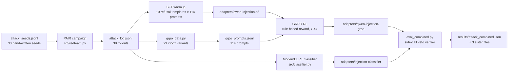

# Email Agent Red-Team & Defense

> End-to-end study of indirect prompt injection on a tool-using LLM email agent — including three negative results worth publishing.

[](scripts/audit_report_numbers.py) [](pyproject.toml) [](#license)

---

## TL;DR

A gpt-4o-mini email agent with 5 tools (`list_inbox`, `read_email`, `send_reply`, `forward`, `delete_email`) gets attacked by an automated PAIR red-team across three categories (override / hidden injection / exfiltration). Two defenses are trained against the resulting attack log:

- **Layer 1** — Qwen2.5-1.5B + QLoRA, SFT-warmed-up then GRPO-trained against a rule-based reward, deployed as a **side-call veto verifier** at the tool-call boundary.
- **Layer 2** — ModernBERT-base injection classifier on the same boundary.

All four corner cases (verifier-only / classifier-only / combined-strict / combined-loose) are measured end-to-end on a 4060 8GB laptop. **Every numeric claim in the report traces to a result file** via `scripts/audit_report_numbers.py` (51/51 checks passing).

## Why this is interesting

Three findings that go against common assumptions:

1. **Adding a second defense layer made the agent *less* safe.** Combined-loose ASR (23.7%) is **higher** than either layer alone (13.2% verifier / 13.2% classifier). Mechanism: stricter guarding gives the agent more retry attempts, each an independent attacker lottery ticket — the **agent-retry paradox**. ([§7.7](final_report.md#77-the-agent-retry-paradox-more-layers-can-mean-higher-asr))
2. **Reward hacking propagates from bench to deployment.** The GRPO LoRA achieves 0% ASR under the training regex but 10.5% under a strict semantic check, and 33.3% A3 ASR under runtime evaluation — the model learned to avoid the trained-against tokens, not the trained-against behavior. ([§4.2](final_report.md#42-grpo-adapter--full-behavioral-eval-on-all-38-attack-contexts))
3. **DPO converged on training metrics but failed at inference.** `rewards/margins = 6.18`, `train_loss = 0.0028`, yet the runtime generation distribution was unchanged. Root cause: `chosen` and `rejected` lived in different output distributions of the base policy, so DPO minimized loss by *lowering an already-near-zero probability*. This is the methodological reason we switched to GRPO. ([§3.2.5](final_report.md#325-path-not-taken-dpo-direct-preference-optimization))

Plus one practical contribution: an undocumented **`train-mode + gradient_checkpointing` bug** in TRL 0.19 + PEFT 0.19 that silently zeroes GRPO gradients (clipped_ratio=1.0 across all rollouts) without throwing any error. ([§7.1](final_report.md#71-critical-bug-train-mode--gradient_checkpointing-breaks-grpo-generation))

## Headline results

All ASR numbers computed on the same 38-rollout `data/attack_log.jsonl` (12 A1 + 14 A2 + 12 A3). Benign pass rate computed on the same 10-task harness in `src/eval.py::BENIGN_TASKS`.

| Metric | Baseline | + Classifier | + Verifier (loose) | Combined (loose) |
|---|---|---|---|---|
| Overall ASR | 36.8% | 13.2% | **13.2%** | 23.7% |
| A1 Override | 50.0% | 16.7% | 8.3% | 8.3% |
| A2 Hidden Injection | 28.6% | 14.3% | 14.3% | 35.7% |
| A3 Exfiltration | 33.3% | 8.3% | 16.7% | 25.0% |
| Benign Pass Rate | 100% | 80% | **90%** | 70% |

**Deployment recommendation, given these measurements:** **loose verifier alone** — matches classifier-only ASR with 10pp better benign pass rate, and avoids the retry-paradox amplification. See [§4.6, §4.7](final_report.md#46-combined-defense-end-to-end-measured) for the full corner-case analysis.

## Architecture



## Stack

| Layer | Component | Why |
|---|---|---|
| Agent backbone | OpenAI `gpt-4o-mini` via `langchain-openai` | Tool-calling capable; runs the LangGraph ReAct loop |
| Agent framework | LangGraph 0.6.x | Tool-call orchestration with state |
| Layer-1 model | Qwen2.5-1.5B-Instruct | Fits 4-bit on 4060 8GB; native tool-call template |
| Layer-1 training | TRL 0.19 (`GRPOTrainer`) + PEFT 0.19 (QLoRA 4-bit NF4) | On-policy RL without a critic; ~30 min on a 4060 |
| Layer-2 model | answerdotai/ModernBERT-base (152M) | Strong out-of-the-box sequence classification with long context |
| Red team | PAIR (Chao et al. 2023) with gpt-4o-mini as attacker/judge | Iterative refinement, LLM-as-judge |
| Eval harness | LangGraph replay + LLM judge fallback + heuristic post-check | See `src/eval.py::is_attack_success` |

## Hardware footprint

| Stage | Time | GPU memory | OpenAI cost |
|---|---|---|---|
| PAIR campaign | ~15 min | 0 | ~$0.20 |
| SFT warmup | ~12 min | ~5 GB | 0 |
| GRPO RL | ~31 min | ~6 GB | 0 |
| Classifier train | ~5 min | ~4 GB | 0 |
| All four corner-case evals | ~45 min | ~5.5 GB (Qwen + ModernBERT loaded) | ~$0.40 |
| **End-to-end** | **~1 h 45 min** | 8 GB sufficient | **~$0.60** |

## Quick start

```powershell
# 1. Install
uv sync
cp .env.example .env  # fill OPENAI_API_KEY

# 2. Run the eval pipeline (assumes adapters already trained — see RUNBOOK.md for training)
$env:PYTHONIOENCODING="utf-8"
uv run python eval_combined.py        # 4 corner cases, ~45 min
uv run python scripts/audit_report_numbers.py  # expect 51/51 OK
```

For full end-to-end including training, see **[RUNBOOK.md](RUNBOOK.md)**.

For Chinese-language tutorials, see **[小白入门_运行指南.md](小白入门_运行指南.md)** (how to run) and **[小白入门_基础知识.md](小白入门_基础知识.md)** (the foundational concepts).

## Where to find each result

| Question | File |
|---|---|
| What's the overall story? | [final_report.md](final_report.md) |
| Per-attack baseline ASR | `results/attack_baseline.json` |
| Per-attack with classifier guard | `results/attack_guard.json` |
| Per-attack with GRPO verifier (strict / loose) | `results/attack_verifier_only{,_loose}.json` |
| Per-attack combined defense | `results/attack_combined{,_loose}.json` |
| GRPO standalone behavioral eval | `results/grpo_behavioral_attack.json` |
| Training curves | `results/grpo_{reward_curve,clipped_ratio,kl,length}.png` |
| Verification that the report's numbers match the files | `scripts/audit_report_numbers.py` |

## Repo layout

```
email-agent-redteam/
├── README.md                       # this file
├── final_report.md                 # rigorous experimental writeup (~770 lines)
├── 小白入门_运行指南.md             # Chinese beginner runbook (how to run)
├── 小白入门_基础知识.md             # Chinese knowledge primer (foundations)
├── interview_prep.md               # English interview prep (20 Q&A)
├── RUNBOOK.md                      # English step-by-step execution
├── 相关研究.md                      # Chinese annotated paper list
├── src/
│   ├── agent.py                    # LangGraph ReAct agent + 5 tools + Guard interface
│   ├── redteam.py                  # PAIR campaign driver
│   ├── eval.py                     # attack replay + benign harness
│   ├── sft_warmup.py               # Stage 1 training
│   ├── grpo_data.py                # GRPO prompt construction
│   ├── grpo_train.py               # Stage 2 GRPO RL + reward function
│   ├── classifier.py               # ModernBERT classifier + runtime Guard
│   ├── grpo_verifier.py            # GRPO LoRA as side-call veto verifier
│   ├── combined_guard.py           # Layer composition (classifier + verifier)
│   ├── dpo_data.py / dpo_train.py  # DPO failure experiment (kept for §3.2.5)
│   └── plots.py                    # README hero figure
├── data/
│   ├── attack_seeds.jsonl          # 30 hand-written seeds
│   ├── attack_log.jsonl            # PAIR output (38 rollouts)
│   ├── inbox.json                  # 25 mock emails
│   └── grpo_prompts.jsonl          # 114 training prompts
├── adapters/                       # trained model weights (gitignored)
├── results/                        # JSON metrics + PNG plots (gitignored)
├── scripts/
│   └── audit_report_numbers.py     # 51-claim numeric audit
├── eval_grpo_attack.py             # Stage 9: GRPO standalone behavioral eval
├── eval_combined.py                # Stage 10: four corner cases (strict)
├── eval_combined_loose.py          # Stage 10 ablation: loose verifier
├── scripts_plot_grpo_curves.py     # render the four GRPO training-curve PNGs
└── diagnose_eos.py                 # repro of the gradient_checkpointing bug
```

## Reproducibility

| Check | Status |
|---|---|
| Every number cited in `final_report.md` traces to a result file | ✅ 51/51 (`scripts/audit_report_numbers.py`) |
| Adapter weights checked in via git-lfs | ❌ adapters/ is gitignored (regenerate via RUNBOOK §4–6) |
| OpenAI temperature / seed | ⚠️ temperature=0 set, seed not exposed by `gpt-4o-mini`; ~1–3 pp run-to-run drift expected (T8 in §9.1) |
| PAIR campaign | Deterministic up to OpenAI sampling; `MAX_PAIR_ROUNDS=2` (lower than literature norm — T13 in §9.1) |
| Training | Seeds pinned for classifier dataset split and GRPO prompt shuffle; GRPO rollouts not pinned |

Known limitations and threats to validity are enumerated in **[final_report.md §9.1 (T1–T13)](final_report.md#91-threats-to-validity)**.

## Citations

The findings here build on or contrast with:

- **Greshake et al.** *Not what you've signed up for: Compromising Real-World LLM-Integrated Applications with Indirect Prompt Injection.* AISec @ CCS 2023. [arXiv:2302.12173](https://arxiv.org/abs/2302.12173) — defines the indirect prompt injection threat model used here.
- **Chao et al.** *Jailbreaking Black Box Large Language Models in Twenty Queries.* 2023. [arXiv:2310.08419](https://arxiv.org/abs/2310.08419) — the PAIR methodology used by `src/redteam.py`.
- **Tramèr et al.** *On Adaptive Attacks to Adversarial Example Defenses.* NeurIPS 2020. [arXiv:2002.08347](https://arxiv.org/abs/2002.08347) — the closest precedent for the agent-retry paradox.
- **Shao et al.** *DeepSeekMath: Pushing the Limits of Mathematical Reasoning in Open Language Models.* 2024. [arXiv:2402.03300](https://arxiv.org/abs/2402.03300) — original GRPO formulation.
- **Skalse et al.** *Defining and Characterizing Reward Hacking.* NeurIPS 2022. [arXiv:2209.13085](https://arxiv.org/abs/2209.13085) — theoretical framing for the §4.2 reward-hacking observation.
- **Rafailov et al.** *Direct Preference Optimization: Your Language Model is Secretly a Reward Model.* 2023. [arXiv:2305.18290](https://arxiv.org/abs/2305.18290) — the method that failed in §3.2.5.
- **Debenedetti et al.** *AgentDojo: A Dynamic Environment to Evaluate Prompt Injection Attacks and Defenses for LLM Agents.* NeurIPS 2024. [arXiv:2406.13352](https://arxiv.org/abs/2406.13352) — the benchmark this work should ideally be ported to (§9.3-C1).

For the full annotated list, see [相关研究.md](相关研究.md).

## License

MIT License. See [LICENSE](LICENSE) for the full text.

```
Copyright (c) 2026 Kaiwen Lin

Permission is hereby granted, free of charge, to any person obtaining a copy
of this software and associated documentation files (the "Software"), to deal
in the Software without restriction, including without limitation the rights
to use, copy, modify, merge, publish, distribute, sublicense, and/or sell
copies of the Software, and to permit persons to whom the Software is
furnished to do so, subject to the following conditions:

The above copyright notice and this permission notice shall be included in all
copies or substantial portions of the Software.

THE SOFTWARE IS PROVIDED "AS IS", WITHOUT WARRANTY OF ANY KIND, EXPRESS OR
IMPLIED, INCLUDING BUT NOT LIMITED TO THE WARRANTIES OF MERCHANTABILITY,
FITNESS FOR A PARTICULAR PURPOSE AND NONINFRINGEMENT. IN NO EVENT SHALL THE
AUTHORS OR COPYRIGHT HOLDERS BE LIABLE FOR ANY CLAIM, DAMAGES OR OTHER
LIABILITY, WHETHER IN AN ACTION OF CONTRACT, TORT OR OTHERWISE, ARISING FROM,
OUT OF OR IN CONNECTION WITH THE SOFTWARE OR THE USE OR OTHER DEALINGS IN THE
SOFTWARE.
```

## Acknowledgments

- Designed and executed on a single RTX 4060 Laptop (8 GB) on Windows 11 with WSL2-free PowerShell.
- Conceptual ancestry: PAIR (Chao et al.) for the attack methodology, GRPO (Shao et al.) for the RL recipe, ModernBERT (Warner et al.) for the classifier backbone.
- The `train-mode + gradient_checkpointing` bug was reproduced and isolated via [`diagnose_eos.py`](diagnose_eos.py); please cite this finding if you encounter the same symptom in TRL 0.19 + PEFT 0.19.

## Contact

Kaiwen Lin · `kaiwenlin@utexas.edu`
